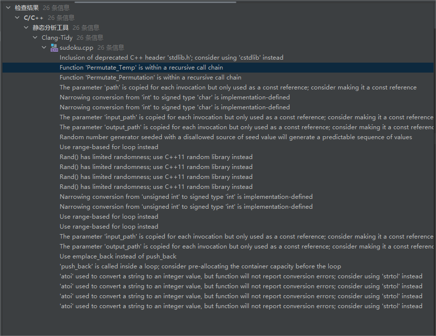

# 软件工程结对编程作业——Sudoku

## 源码地址
<https://github.com/DavisElppa/Sudoku>

## 文件结构

`sudoku.cpp`: 数独程序主函数

`test.cpp`: 测试程序

`end_game.txt`: 数独终局文件

`game.txt`: 数独游戏文件

`sudoku.txt`: 求解结果文件

`sudoku.exe`: 可执行程序

## 使用手册

**参数解析**

| 参数名字 | 参数意义         | 范围限制      | 用法示例                                                                          |
|------|--------------|-----------|-------------------------------------------------------------------------------|
| -c   | 需要的数独终盘数量    | 1-1000000 | 示例: sudoku.exe -c 20 [表示生成20个数独终盘]                                            |
| -s   | 需要解的数独棋盘文件路径 | 绝对或相对路径   | 示例: sudoku.exe -s game.txt [表示从game.txt读取若干个数独游戏，并给出其解答，生成到sudoku.txt中]       |
| -n   | 需要的游戏数量      | 1-10000   | 示例: sudoku.exe -n 1000 [表示生成1000个数独游戏]                                        |
| -m   | 生成游戏的难度      | 1-3       | 示例: sudoku.exe -n 1000 -m 1[表示生成1000个简单数游戏，只有m和n一起使用才认为参数无误，否则请报错]            |
| -f   | 生成游戏中挖空的数量范围 | 20-55     | 示例: sudoku.exe -n 20 -r 20~55[表示生成20个控空数在20到55之间的数独游戏，只有r和n一起使用才认为参数无误，否则请报错] |
| -u   | 生成游戏的解唯一     |           | 示例: sudoku.exe -n 20 -u[表示生成20个解唯一的数独游戏，只有u和n一起使用才认为参数无误，否则请报错]               |

本数独游戏仅支持命令行操作，分为生成数独终盘、生成数独游戏、生成解三步，操作类型用命令行参数控制，其中在生成数独游戏时有难度、是否有唯一解等进阶选项，
通过-m，-r等参数指定。

由于数独的难度仅和空格数量有关，我们对 `简单`、`普通`、`困难`三个难度通过空格数进行划分，由于数独的理论空格数上限为64，
我们将20\~31空定为`简单`（20空以下过于简单没有意义），将32\~47空定为`普通`，48\~64为`困难`。玩家也可以自己通过-r参数指定空格数。

## 质量分析
我们采用Clion自带的代码分析工具进行了质量分析，第一次质量分析结果如下：

可以看到由于打开了Clang-Tidy检查项，代码存在很多由方法过时、代码不规范等引起的警告，
经过修改和优化，再次进行质量分析，无警告和报错，结果如下：

## 测试覆盖率
为了对代码进行单元测试，我们选用VS2019的本地单元测试项目搭配OpenCPPCoverage覆盖率测试工具完成。

首先我们对每一个函数的各个分支与可能情况编写测试样例进行单元测试，得到测试结果如下所示：

可以看到测试样例全部通过，接下来使用OpenCPPCoverage计算测试覆盖率:

由上图可以看到，我们的单元测试覆盖了479行，部分覆盖4行，未覆盖93行，最终的测试覆盖率为：83.16%。

